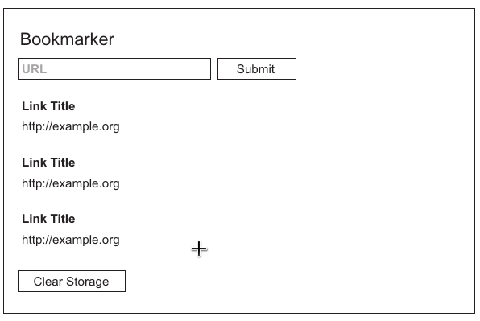

# Chapter 02. Your First Electron Application

## Overview

- Structuring and setting up an Electron application
- Generating a package.json, and configuring it to work with Electron in development
- Including a prebuilt version of Electron for your platform in your project
- Configuring your package.json to start up your main process
- Creating renderer processes from your main process
- Taking advantage of Electron’s relaxed sandboxing restrictions to build functionality that normally would not be possible inside of the browser
- Using Electron’s built-in modules to side-step some common issues

## 2.1 Building a bookmark list application

- **Goal**:

  - fetch the title of the page that the URL provided by users
  - save it in our application's `localStorage`
  - display all the links in the application

- App wireframe goes as



### 2.1.1 Structuring the Electron application

All the applications that we build in this book roughly follows the directory structure as follows

```bash
|----app/             # all application code
| |----main.js        # main process code
| |----renderer.js    # renderer process code
|----package.json     # dependencies manifest, metadata, scripts and entry to main process
|----test/
```

### 2.1.2 `package.json`

- Usage
  - lists metadata such as
    - the name of the author
    - email address of author
    - license
    - the location of the project's git repository
    - where to file issues
  - defines scripts for common tasks such as
    - running the test suite
    - building the application
  - lists all of the dependencies used to run and develop the application
- `yarn` is package manager tool helps to generate `package.json` (another is the official `npm` shipping with Node)
- The main entry is set to `./app/main.js` for our purpose

### 2.1.3 Downloading and installing Electron in our project

- Requirement: prebuilt versions of Electron for each platform (macOS, Windows, and Linux) and both architectures (32- and 64-bit)
- Recommends to install Electron locally with command

```bash
yarn add electron
```

> electron vs electron-prebuilt
> electron is the preferred way for development, and electron-prebuilt is no longer supported as of early 2017

- `yarn` allows defining shortcuts for running common scripts in `package.json`
- When you run a script defined in your `package.json`, `yarn` automatically adds `node_modules` to the path, which will assign higher priority to local packages against the global ones

## 2.2 Working with the main process

- By means of the modules provided by the `electron` library
- `app` is one of such module from `electron` library
  - handles the lifecycle and configuration of our application
  - provides api to to quit, hide, and show the application as well as get and set the application's properties
  - provides events hook -- including
    - `before-quit`
    - `window-all-closed`
    - `browser-window-blur`
    - `browser-window-focus`
    - `ready`: signals the app has been up
- Main process does not have a DOM (Document Object Model) and cannot render a UI
- The main process is responsible for
  - interacting with the operating system
  - managing state
  - coordinating with all the other processes in our application
  - not in charge of rendering HTML and CSS

## 2.3 Creating a renderer process

- Renderer process serves to render HTML and CSS
- Renderer processes are created by the main process using the `BrowserWindow` module
- Each `BrowserWindow` is a separate and unique renderer process that includes
  - a DOM
  - access to the Chromium web APIs
  - the Node built-in module.

> A standard JavaScript convention: module starting with a capital letter can be called as constructor with the `new` keyword

- `BrowserWindow` exposes API through its `webContents` property, such as
  - load an HTML page into window
  - send messages from the main process to the renderer processes
  - print pages to either PDF or a printer

### 2.3.1 Loading code from the renderer process

- What makes Electron different from what we're used to in the browser is that we have access to all of Node

### 2.3.2 Requiring files in the renderer process

- As codebase grows, build tools can help to maintain the modular architecture of the project.
- Common build tools include
  - Browserify
  - webpack
  - Gulp
  - Grunt
- Node's module system with no additional configuration

### 2.3.3 Adding styles in the renderer process

- Our applications will run only in the version of Chromium shipped with the application
- No need of cross-browser support or legacy compatibility
- Reference our new stylesheet just like in the traditional browser environment

## 2.4 Implementing the UI

- Query and cache the elements into variables for reuseing
- Set the input element's type attribute to `url` to make use of the validity checking capability provided by Chromium's `ValidityState` API

### 2.4.1 Making cross-origin requests in Electron

- In a traditional browser-based application
  - client-side codes ain't allowed to make requests to other servers
  - typicall requires a intermediate server as proxy
- Electron has all the abilities of a Node server along with all the bells and whistles of a browser
- New feature like `Fetch` API supported by Chromium is ready for making requests to remote servers
- Due to a lack of servers, we need to prevent the default action of making form request
- Fetching a URL by `Fetch` API returns a _promise_ object, which will be fulfilled when the browser has completed fetching the remote resource

### 2.4.2 Parsing responses

- `DOMParser` is provided by Chromium for parsing html content, which helps to to filter out the wanted title of the page

### 2.4.3 Storing responses with web storage APIs

- `localStorage` is a simple `key/value` store that is built into the browser and persists between sessions
- A simple storage implementation
  - make a simple object out of the title and URL
  - convert it into a string using the built-in JSON library
  - store it using the URL as the key

### 2.4.4 Displaying request results

- Use `Object.keys()` to get all keys out of `localStorage`
- We need to take these simple objects indexed by keys of `localStorage` and convert them into markup so that we can add them to the DOM later

> Using promises helpes to improve readibility of code indicated by helper functions' names.

### 2.4.5 The unhappy path

- Problems

  - Not really valid URL
  - Unreachable URL signaled by 400- or 500-level error

- Solution
  - add error catching clause for promise chain resolving to handle any error thrown during invoking the chain
  - validate the status of response by the `ok` property of `response`

### 2.4.6 An unexpected bug

- External links would be displayed `BrowserWindow` without Back button or a location bar. Once navigated to the clicked URL, we're stuck unless restarting over
- Solution is to open the links in a real browser
- Employ `shell` module of `electron` to handle the high-level desktop integration
  - it can ask the user's OS what browser they prefer and pass the URL to that browser to open
