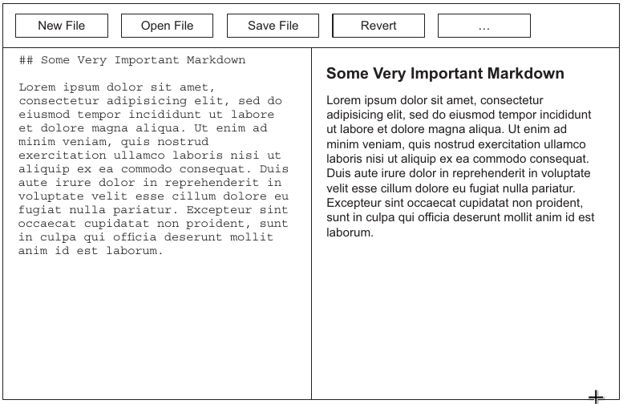
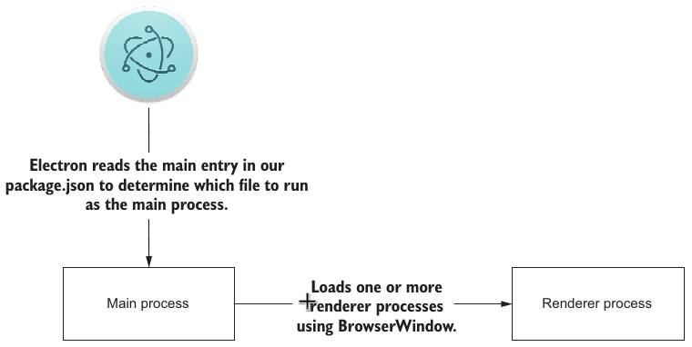
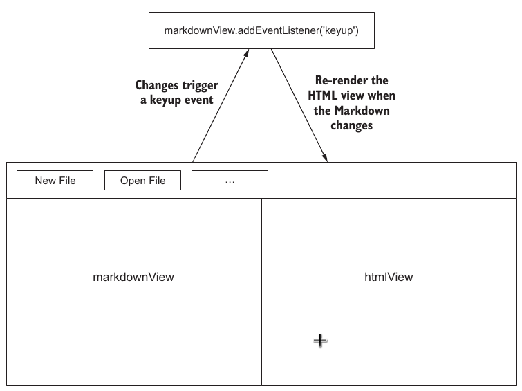

# Chapter 03. Building a notes application

## 3.1 Defining our application

### Wireframe

- two panels
  - a left pane where the user can write or edit Markdown
  - a right pane that displays the user’s Markdown rendered as HTML
- control buttons along the top: allow the user to
  - load a text file from the filesystem
  - write the result to the clipboard or filesystem

shown as



### Functions

- Open and save files to the filesystem
- Take Markdown content from those files
- Render the Markdown content as HTML
- Save the resulting HTML to the filesystem
- Write the resulting HTML to the clipboard

## 3.2 Laying the foundation

### File structure

```
|--Project
  |--LICENSE
  |--README.md
  |--app
    |--index.html   // UI
    |--main.js      // main process
    |--renderer.js  // interactivity of UI
    |--style.css    // UI style
  |--package.json   // dependencies management and entry point specification for Electron
```

### The workflow



## 3.3 Bootstrapping the application

as demo by [main.js](./firesale/app/main.js)

### 3.3.1 Implementing the UI

Markup goes as [index.html](./firesale/app/index.html)

> The column layour is actually backed by the flexbox feature of css3

### 3.3.2 Gracefully displaying the browser window

- **Problem**: a brief moment when the window is completely blank before Electron loads `index.html` and renders the DOM in the window
- **Solution**: show the window after UI is ready (signaled by event `ready-to-show`)

## 3.4 Implementing the base functionality

- User case goes as



- Solution
  - rendering markdown by `marked` library (goes as the `renderMarkdownToHTML` in [renderer.js](./firesale/app/renderer.js))
    > pass in an option object with the `sanitize` property set to `true` to prevent accidental script injections
  - listen on the `keyup` event of `markdownView` panel to achieve reactive rendering

## 3.5 Debugging an Electron application

### 3.5.1 Debugging renderer processes

by **Chrome Developer Tools** accessed by

- shortcut
  - `Command`-`Option`-`I` on macOS
  - `Control`-`Shift`-`I` on Windows/Linux
- programmatically by the `openDevTools()` on `BrowserWindow/BrowserWindow.webContents`

### 3.5.2 Debugging the main process

by Node Inspector

- not fully supported
- start the app using the `--debug` flag, and then remote debugging is enabled on port 5858

### 3.5.3 Debugging the main process with Visual Studio Code

1. set up a `node`-type build task (as `firesale/.vscode/tasks.json`)

   - ok for both debugging and starting up the app

2. configure app lanuching and connect it to its built-in debugger as `firesale/.vscode/launch.json`
