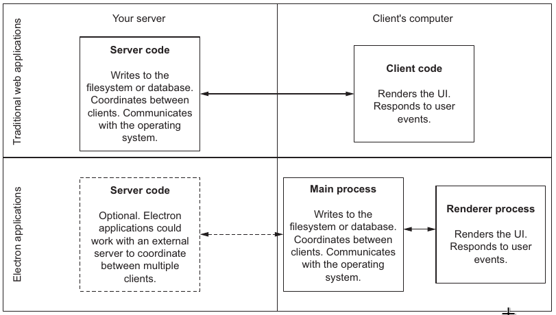
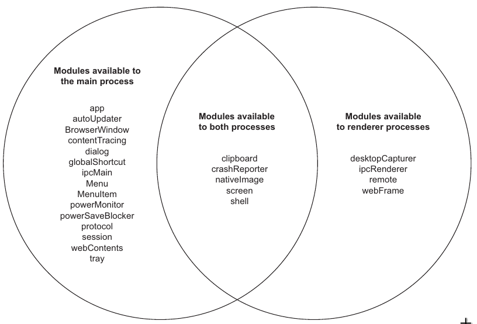
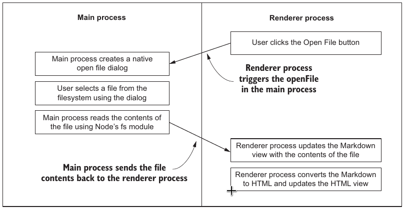
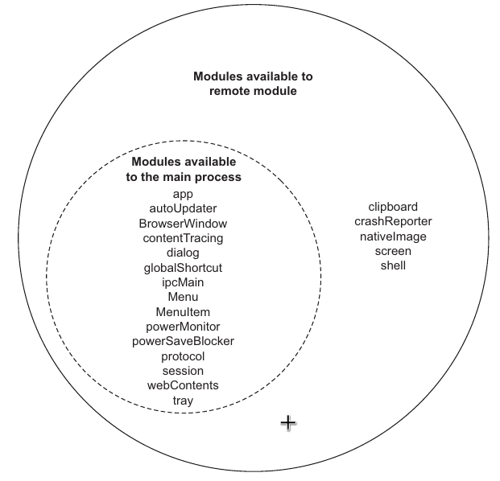

# Chapter 04. Using native file dialog boxes and facilitating interprocess communication

## Overview

- Implementing a native open file dialog box using Electron's `dialog` module
- Facilitating communication between the main process and a renderer process
- Exposing functionality from the main process to renderer processes
- Importing functionality from the main process into the renderer process using Electron's `remote` module
- Sending information from the main process to a renderer process using the `webContents` module and setting up a listener for messages from the main process using the `ipcRenderer` module

## Goal

- Read in file path with custom extension by `dialog` module
- Read out content from the selected file by the Node's built-in `fs` module

## 4.1 Triggering native file dialog boxes

- create native dialogs using `dialog` module
- trigger the opening dialog by [`dialog.showOpenDialog([browserWindow, ], options[, callback])`](https://electronjs.org/docs/api/dialog#dialogshowopendialogbrowserwindow-options-callback)
  - `openFile` value of properties signifies the dialog box is for opening file

## 4.2 Reading files using Node

- `dialog.showOpenDialog()` returns an array consisting of the paths of the file or files that the user selected
- The built-in `fs` library helps to read the content from files

### 4.2.1 Scoping the Open File dialog

- By default, `dialog.showOpenDialog()` lets us open any file on our computer without filtering by file types
- The `filters` property in `options` can whitelist the types of files to open

### 4.2.2 Implementing dialog sheets in macOS

- **WHY**: the names for file extension filters is unavailable in macOS
- **HOW**: pass a reference to the `BrowserWindow` instance as anchor

## 4.3 Facilitating interprocess communication

- The division of responsibilities in Electron applications versus traditional web applications
  
- In traditional web applications, we typically facilitate communication between the client- and server-side processes using a protocol like HTTP
- In electron
  - The main process is in charge of interfacing with the native operating system APIs
    
  - Electron provides only a subset of its modules to each process and doesn't keep us from accessing Node APIs that are separate from Electron's modules
  - The UI that likely triggers these operations is called in the renderer process
- Implementing the Open File button goes as  
  

### 4.3.1 Introducing the remote module

- `remote` module available only in the renderer process, works as a proxy to the main process by mirroring the modules that are accessible in the main process
- The `remote` module also takes care of communication to and from the main process when we access any of those properties
- When we call a method or property on the remote object, it

  - sends a synchronous message to the main process
  - executes in the main process
  - sends a message back to the renderer process with the results

- The remote module shares many of the same properties as the Electron module in the main process
  

## 4.4 Triggering the Open File function using interprocess communication

### 4.4.1 Understanding the CommonJS require system

- Node's module system consists of two primary mechanisms
  - the ability to require functionality from other sources, and
  - the ability to export functionality to be consumed by other sources
- Every module in Node has a built-in object called `exports` that starts out as an empty object. Anything we add to the `exports` object is available when we require it from another file

### 4.4.2 Requiring functionality from another **process**

- `remote.require()` requires functionality from the main process in our renderer process
- Electron takes care of the interprocess communication (main<->renderer) of the proxy object returned from `remote.require()`
- `remote.require()` imports code evaluated in terms of the main process not the renderer process

## 4.5 Sending content from the main process to the renderer process

- Each `BrowserWindow` instance has a property called `webContents`, which stores an object responsible for the web browser window that we create when we call `new BrowserWindow()`
- `webContents` emits events based on the lifecycle of the web page in the renderer process
- Events triggered by `webContents` include
  - `did-start-loading`
  - `did-stop-loading`
  - `dom-ready`
  - `blur`
  - `focus`
  - `resize`
  - `enter-full-screen`
  - `leave-full-screen`
- Method alias between `BrowserWindow` and `webContents`
  - `loadURL()`
  - `reload()`
  - `print()`
  - `printToPDF()`

### 4.5.1 Sending the file contents to the renderer contents

- `BrowserWindow.webContents.send()` send data from the main process to the renderer process in form of events
- `ipcRenderer.on()` listens for the event and retrieve the data from the event callback
  - takes two arguments as
    - the channel to listen on
    - a callback function that defines an action to take when a message is put on the channel
- Electron comes with two basic modules for sending messages back and forth between processes
  - `ipcRenderer` in the renderer process
    - `ipcRenderer.on()` takes two arguments
  - `ipcMain` in the main process
