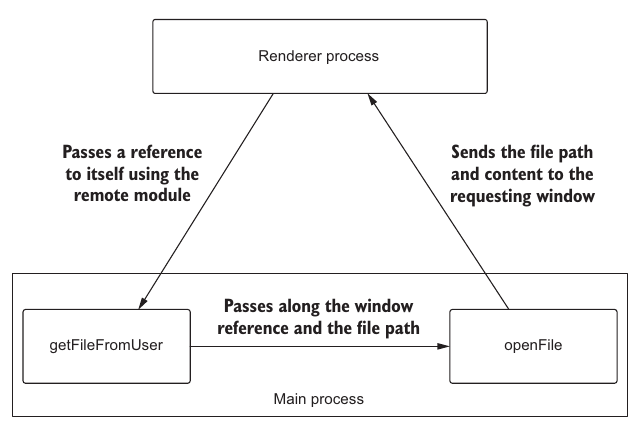

# Working with multiple windows

## Overview

- Tracking multiple windows using the JavaScript `Set` data structure
- Facilitating communication between the main process and multiple renderer processes
- Using Node APIs to detect what platform the application is running on

## 5.1 Creating and managing multiple windows

- A set is a collection of unique elements; an array can have duplicate values in it.
  > `Set` is employed since it eases to the removal of an element

### 5.1.1 Communicating between the main process and multiple windows

- Use case: send the file path and contents to the window requesting them
- To implement the use case, the renderer process must send a reference to itself when communicating to the main process to call `getFileFromUser()`

  

### 5.1.2 Passing a reference to the current window to the main process

- `remote.getCurrentWindow()` which returns a reference to the `BrowserWindow` instance from which it was called

## 5.2 Improving the user experience of creating new windows

- **Problem**: each new window appears in the same default position as the first window and completely eclipses it
- **Solution**
  1. `BrowserWindow.getFocusedWindow()` to get a reference to the window with which the user is currently working
  2. Then call `getPosition()` of the window instance to get its position `(x,y)`
  3. Finally, add an offset to `(x,y)` and set them as the new position of the window to create

## Integrating with macOS

- In macOS, many -- but not all—applications remain open, even when all their windows are closed
- By default, Electron quits the application when it fires its `window-all-closed` event. If we want to prevent this behavior, we must listen for this event and conditionally stop it from closing if we're running on macOS
  - the `process.platform` environment variable is `darwin` on macOS
- What happens if the user clicks the application in the dock and no windows are open?
  - The `activate` event passes two arguments to the callback function provided
    - The first is the `event` object.
    - The second is a boolean, which returns
      - `true` if any windows are visible
      - `false` if all the windows are closed
  - The `activate` event fires only on macOS
