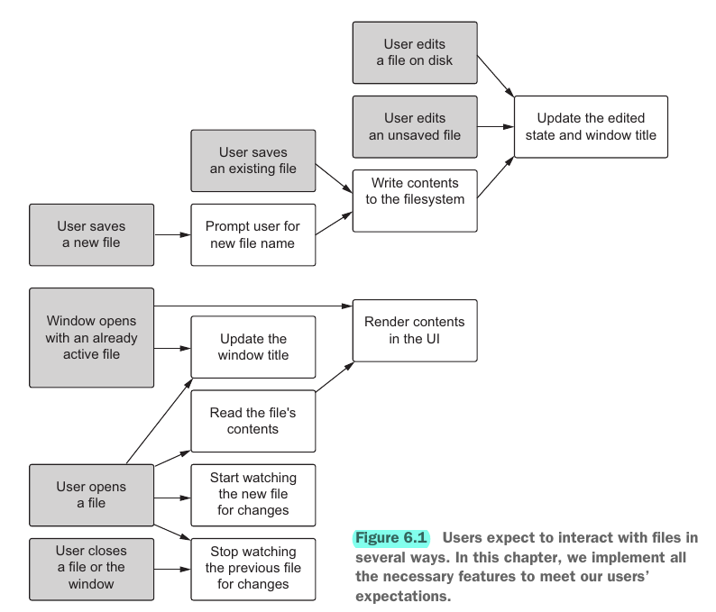

## Chapter 06. Working with files

## Overview

- Determining if the content has been edited and is unsaved
- Modifying the window's title based on the state of the currently active document
- Using custom interactions available to windows in applications running on macOS
- Implementing append documents to the operating system's list of recent documents
- Watching for changes to the current file from the operating system

## 6.1 Keeping track of the current file

- Workflow  
  

### 6.1.1 Updating the window title based on the current file

- By default, the application's window displays the title of the HTML page, which is defined in app/index.html
- All `BrowserWindow` instances have a method called `setTitle()` that allows us to programmatically manipulate the window's title
- The file path can be long serving as a window title, so we use `path.basename()` to extract the name of the file itself from the full file path

### 6.1.2 Determining whether the current file has changed

- To determine whether the file has been modified, we need two pieces of information: the original and current contents of the file
- Show visual cue for being edited with `BrowserWindow.setDocumentEdited(yes: boolean)`
  - This will subtly modify the window on macOS
  - For Windows and Linux users, we append (Edited) to the window title

### 6.1.3 Enabling the Save and Revert buttons in the UI

- The activation of the two buttons is determined by the editing state

### 6.1.4 Updating the represented file on macOS

- `BrowserWindow.setRepresentedFilename()`
  - Accepts a valid file path as an argument, showing where the file exists in the filesystem's hierarchy
  - **Function in macOS only**
- **HOW**: 2 options
  - Set the represented file in the main process before sending the path and content to the renderer process
  - Use the `currentWindow` reference in the renderer process after it has received the file

## 6.2 Tracking recently opened files

- `app.addRecentDocument(path)` add a file path `path` to the recent documents list in Electron
- Use case: Selecting an item from the Recent Documents menu is one instance where the user wants to open a file without being prompted with an Open File dialog box
- Whenever a file is opened from outside of the application, Electron's app module fires an `open-file` event
- `will-finish-launching` event signals the application is fully up and running, where we can deal with the files opened with our app outside

## 6.3 Saving files

- Show in the UI
  - Where the current file is being saved
  - If it has been modified since the last time it was saved to the filesystem

### 6.3.1 Exporting the rendered HTML output

- **HOW**: Ask the user for a filename and location to write to the filesystem

- Open a dialog guiding the saving by `dialog.showSaveDialog()` with options as
  - `title`: Sets the title of the dialog box. This will not appear in macOS.
  - `defaultPath`: Sets the default directory for the Save dialog box
  - `buttonLabel`: Allows you to set custom text for the Save button
  - `filters`: Sets what files are enabled to select to overwrite. Electron also uses this option to set a default file extension, if the user does not provide one

### 6.3.2 Common paths

- `app.getPath(name)` automatically returns the correct file path bound to the given `name` based on the user's platform
  - `home` resolves to the user's home directory
  - `desktop`, `documents`, `downloads`, `pictures`, `music`, and `videos` each resolve to the corresponding path within the user's home directory
  - `temp` resolves to the operating system's temporary file directory
  - `exe` resolves to the location of the current executable
  - `appData` resolves to the user's application data directory
    - `%APPDATA%` on Windows
    - `~/Library/Application/Support` on macOS
    - `$XDG_CONFIG_HOME` or `~/.config` on Linux
  - `userData` resolves to `appData` with the name of the application appended
    - `~/Library/Application/Support/appname` on macOS, where `appname` comes from the name entry in your `package.json`
- Override any path above with `app.setPath(name, path)` before the app fires its `ready` event

### 6.3.3 Saving files from the renderer process

- To achieve more robustness, add a doctype as well as `<html>`, `<head>` and `<body>` tags to make it a valid HTML document

### 6.3.4 Saving the current file

- No need of checking the existence of file since they already exist

### 6.3.5 Reverting files

- **HOW**
  - Replace the value of the Markdown view with the original content of the file that we cached when we last opened or saved i
  - Trigger the re-rendering

## 6.4 Opening files using drag and drop

### 6.4.1 Ignoring dropped files everywhere else

- Disable the default behavior by adding an event listener to the document itself that prevents the default action

### 6.4.2 Providing visual feedback

- When a user is dragging a file, we have access only to its metadata
- Only after the user officially drops the file do we have access to the File object
- During the `dragover` phase, we can give the user a visual clue as to whether the drop is going to be successful by adding different class to elements under the cursor

### 6.4.3 Opening dropped files

## 6.5 Watching files for changes

- **WHY**: If we open a Markdown file in some other editor and make changes to it, Fire Sale is blissfully unaware
- **HOW**: Employ the Node's `fs.watchFile` to use operating system-specific libraries to monitor a file or directory and emit an event if the file changes

  1. Sets up a data structure for tracking our file watchers and the window that they're associated with
  2. Begins watching for file changes upon opening a file
  3. When opening subsequent files, closes the existing watcher before creating a new one
  4. Closes the watcher when the window is closed

- The one caveat to avoid memory leak: We must be careful to stop watching files when we open new ones

## 6.6 Prompting the user before discarding changes

- `dialog.showMessageBox()` is a general-purpose, customizable dialog box
  - You can provide a list of button labels to the buttons array
  - `dialog.showMessageBox()` returns the index of the button that the user selected
- Two scenarios about safeguarding against losing changes
  - Open another file in the same window
  - Another app change the same file
