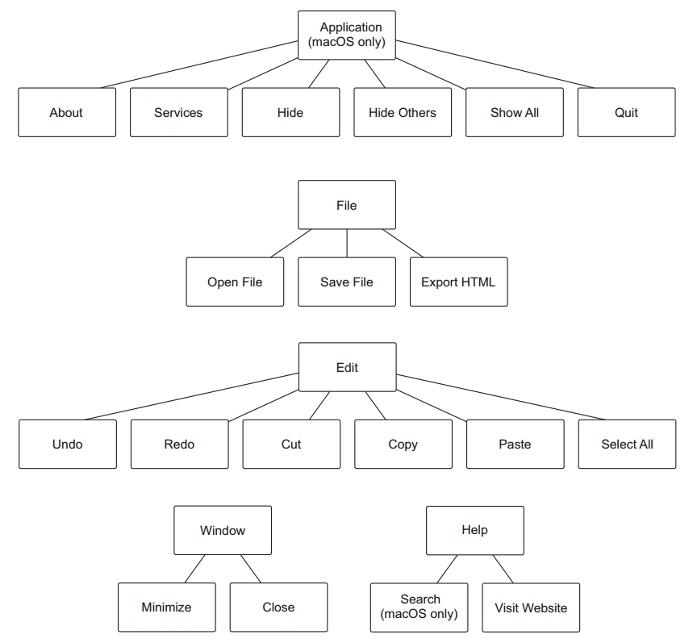
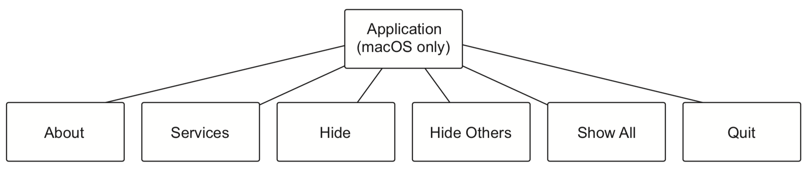

# Chapter 07. Building application and context menus

## Overview 

- Creating menus using Electron's `Menu` and `MenuItem` modules
- Building menus from a template
- Defining custom menus for target operating systems
- Assigning common operating system roles to our menu items
- Making menu items with custom, applicationspecific functionality
- Creating custom context menus for different parts of your UI

## Electron vs Browser 
- In browser-based applications, the entire UI for the application's functionality must be inside of the window
- A menu structure for Fire Sale to implement goes as 
  

## 7.1 Replacing and replicating the default menu 

- Electron includes the `Menu` and `MenuItem` modules for building menus
- Building a menu out of individual `MenuItems` can be tedious and error prone
- As a convenience, `Menu` provides the `buildFromTemplate()`  method that accepts an array of regular JavaScript objects. Internally, Electron creates the `MenuItems` based on the array you provided

### 7.1.1 macOS and the case of the missing `Edit` menu 

- In macOS, the menu is called `Electron` rather than `Edit` because the first menu on macOS is always the Application menu
    - Solution: `unshift` the wanted menu item to the front of the `Menu`
    > `Electron` is always the default name in the menu bar until the app is packaged and deployed
- `process.platform` returns the name of the platform in which the application is currently executing, which is one of five strings
    - `darwin`: upon which macOS is built
    - `freebsd`
    - `linux`
    - `sunos`
    - `win32`

### 7.1.2 The hidden cost of replacing Electron's default menu 
- When we replace the menu, we lose all its original functionality. Not only do we lose a few menu items, we also lose their **keyboard shortcuts**
- Electron provides `role`s for `MenuItems` allowing developers to easily implement common, operating system-level functionality.

### 7.1.3 Implementing the Edit and Window menus 

- As the `Edit` menu item in [menu.js](firesale/app/menu.js)

### 7.1.4 Defining menu item roles and keyboard shortcuts 

- Menu items can have a `role`, which correlates to a built-in capability provided by the operating system to all applications
- `role` can be set to any of the following:
    - `undo`
    - `redo`
    - `cut`
    - `copy`
    - `paste`
    - `selectall` 
    - `minimize` 
    - `close`
- Adding menu items with these roles restores the functionality to the menu but not the keyboard shortcuts that many users are accustomed to
- Electron provides an additional property called `accelerator` for defining a keyboard shortcut to trigger a menu item's action
- The `CommandOrControl` shorthand binds the keyboard shortcut
  - macOS's `Command` key
  - windows'/linux's Control key 
- `Cmd`, `Ctrl`, and `CmdOrCtrl`, which are aliased to `Command`, `Control`, and `CommandOrControl`, respectively

### 7.1.5 Restoring the application menu on macOS 
- When Electron runs, it compiles the template into a collection of `MenuItems` and sets the application's menu accordingly
- Standard application menus in macOS goes as 
   
- Additional roles are
    - `about`
    - `hide`
    - `hideothers` 
    - `unhide` 
    - `front`
    - `window`: adds the ability to **close** and **minimize** the current window from the Window menu, as well as a list of all of the application's windows, and the ability to bring them all to the front.
    - `help`
    - `services`

### 7.1.6 Adding a Help menu 
- The built-in `Help` menu allows users to search the application to find menu items
- Access the menu search by pressing `Command`-`Shift`-`?` at any time

## 7.2 Adding application-specific menu functionality 
- Going through all that work to restore a lot of the functionality, which we originally got for free, is worth it only if we use it as a template to add custom functionality
- Sending a message to the focused window is half the battle. We still need to configure the renderer process to listen for these messages and act accordingly

### 7.2.1 Handling the case of having no focused window 
- Solution: Open a new window if the user selects `Open File`, and display an error message if there is no content to save or export
- `dialog.showErrorBox()` specializes in displaying error messages and doesn't have as many options for configuration

## 7.3 Building context menus 
- Context menus: Additional menus in the renderer process, that spring into action when the user right-clicks (or does a two-finger click on certain computers) a part of the UI
- **HOW**: Listens on the `contextmenu` event on a DOM node, and triggers the opening of the menu by invoking a menu's `popup` method
- `Menu.popup()` 
    - Takes four optional arguments
      - A `BrowserWindow`
      - `x`
      - `y`
      - A `positioningItem`
    - If all arguments are omitted, then the context shows up in the current browser window directly under the mouse cursor 